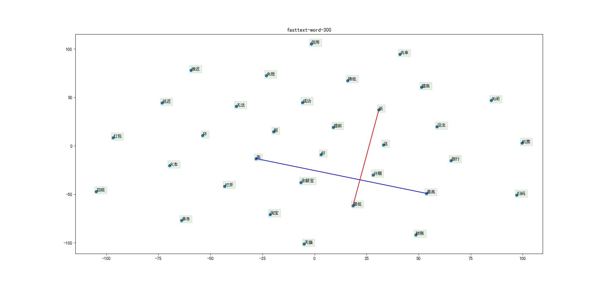
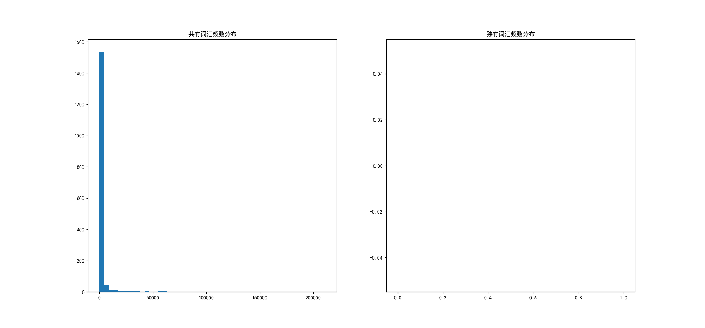

# atec_nlp_sim
https://dc.cloud.alipay.com/index#/topic/data?id=3

# 预处理  
## 对atec  
+ 合并训练集  
+ 繁体转简体  
``opencc -i atec_nlp_sim_train_all.csv -o atec_nlp_sim_train_all.simp.csv -c t2s.json``
+ 生成繁体转简体字典  
+ 分词保存  
+ 分析标签分布  
 
+ 分析句长分布  

    
+ 10折得训练集和验证集  
+ 形成语料库：字级别和词级别   

# 词向量
## 使用GloVe训练词向量
min_count=2,embedding_size=300,epochs=15,window_size=8,x_max=10  
## 使用fastText预训练好的300维词向量
+ 由于内存大小限制，使用.vec文件!  
## 类比关系可视化
### word级
+ glove+atec  

+ fastext  

### char级  
+ glove+atec  

+ fasttext  

## 分析词汇覆盖率
与全局训练数据中min_count=2的vocab进行比较！
### word级
+ glove+atec  

+ fastext  

### char级  
+ glove+atec  

+ fasttext  

## 词向量使用
在训练集中词频数不小于2且在词向量词汇中的词使用对应词向量；
在训练集中词频数不小于2但不在词向量词汇中的词随机初始化，该情况记作编号1；
在训练集中词频数小于2的当作<unk>随机初始化，该情况记作编号2。
static：词向量在模型训练过程中保持不变；nonstatic：词向量在模型训练过程中一起训练。
### A
+ 词级：nonstatic  
+ 字级：nonstatic  
### B
+ 词级：static+1&2trainable  
+ 字级：nonstatic  
### C
+ 词级：static+1&2trainable  
+ 字级：static+1&2trainable 

# 模型
Evaluating with file: data/atec/10/train0.csv, local dict: data/atec/10/train0-2-2.json...  
Evaluating with file: data/atec/10/valid0.csv, local dict: data/atec/10/train0-2-2.json...
## SenMatchSen

+ 是否共用编码层  

| reuse | num_params | epoch | threshold | t_f1 | v_f1 | threshold | t_f1 | v_f1 |
| :---: | :---: | :---: | :---: | :---: | :---: | :---: | :---: | :---: |
| False | 2490441 | 68 | 0.50 | 0.6688 | 0.5360 | 0.40 | 0.6861 | 0.5533 |
| True | 1638693 | 37 | 0.50 | 0.7044 | 0.5426 | 0.35 | 0.7051 | 0.5560 |
+ dropout取值  

| dropout | num_params | epoch | threshold | t_f1 | v_f1 | threshold | t_f1 | v_f1 |
| :---: | :---: | :---: | :---: | :---: | :---: | :---: | :---: | :---: |
| 0.05 | 1638693 | 37 | 0.50 | 0.7044 | 0.5426 | 0.35 | 0.7051 | 0.5560 |
| 0.1 | 1638693 | 37 | 0.50 | 0.7076 | 0.5447 | 0.40 | 0.6955 | 0.5562 |
| 0.2 | 1638693 | 29 | 0.50 | 0.6409 | 0.5269 | 0.30 | 0.6694 | 0.5653 |
| 0.4 | 1638693 | 42 | 0.50 | 0.6824 | 0.5489 | 0.40 | 0.6855 | 0.5607 |
## SeqMatchSeq

+ dropout取值  

| dropout | num_params | epoch | threshold | t_f1 | v_f1 | threshold | t_f1 | v_f1 |
| :---: | :---: | :---: | :---: | :---: | :---: | :---: | :---: | :---: |
| 0.1 | 505941 | 44 | 0.50 | 0.6940 | 0.5533 | 0.40 | 0.6982 | 0.5725 |
| 0.2 | 505941 | 67 | 0.50 | 0.7085 | 0.5583 | 0.50 | 0.7085 | 0.5583 |
| 0.4 | 505941 |  | 0.50 |  |  |  |  |  |
## SeqMatchSeq_BiMPM

+ dropout取值  

| dropout | num_params | epoch | threshold | t_f1 | v_f1 | threshold | t_f1 | v_f1 |
| :---: | :---: | :---: | :---: | :---: | :---: | :---: | :---: | :---: |
| 0.1 | 407381 | 44 | 0.50 | 0.6865 | 0.5716 | 0.50 | 0.6865 | 0.5716 |
| 0.2 | 407381 |  | 0.50 |  |  |  |  |  |
| 0.4 | 407381 |  | 0.50 |  |  |  |  |  |
